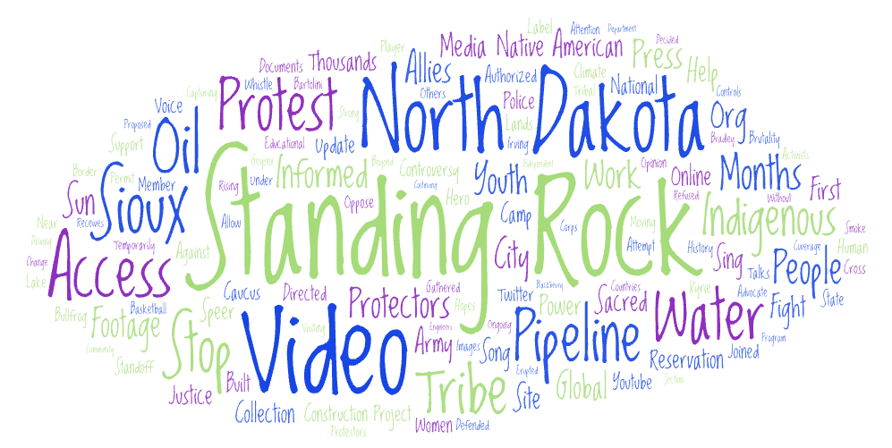
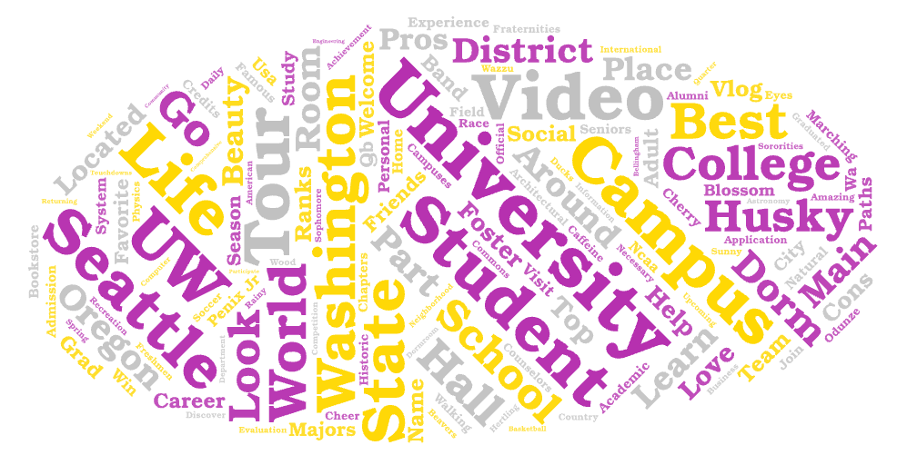
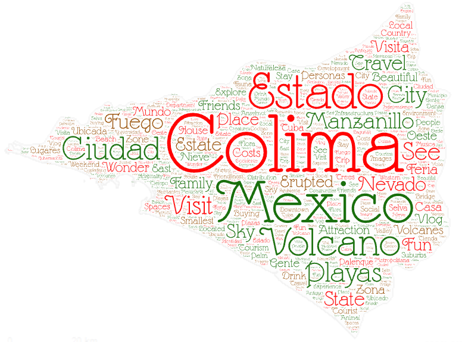

# Lab 2 - GEOG 458

## Narrative

- ***Topics and parameters used in my search***
For my research, I decided to use the same "Standing Rock" and "University of Washington" examples used in the lab so I could have an idea of what information the bot was going to give me and have an outline of what to do with the location parameter. This is why for the location I decided to use the city of "Colima, Mexico" so I could have three topics to compare and research.

- ***Why I wanted to make this comparison***
The reason I decided to use these three topics to make the comparison is because they were all about different and unique places across the world. I was also curious to see the different keywords used in the YouTube videos for said places to analyze the type of content people were watching and what this means for the perspective they get from the place or situation.

- ***Similarities and differences between the different parameters***
One similarity I found after comparing the word clouds for the three different parameters I chose is that the location is always one of the biggest words in the cloud. This also includes unique characteristics about the place such as the environment around them or even the weather. When it comes to the differences, they were much more clear to identify and they also helped to paint a picture of the type of information the videos contained. For example, the Standing Rock word cloud has more words related to the conflict that was occurring related to the pipeline in indigenous land and the protests that occurred because of it. Although the word cloud for both UW and Colima was focused on a place, the words that accompanied each one were very different because in the case of UW it related more to the academic aspect, and for Colima they were more about characteristics of the city itself.

- ***Possible reasons for the patterns observed***
I think that the main reason why the similarities are present is that regardless of the topic, all of these word clouds contain information that is based on a specific place and thus that is present in most videos. As for the differences, I think that can be attributed to the context behind each place and what makes them unique and different from others.

- ***How my research could be improved in the future***
I would really like to get more experience with the bot because although it was fun watching it iterate over the different videos and produce a dataset, I think it would be really fun to program different things that will allow it to have more interaction with a website like YouTube and produce different data. In the future, I would also like my research to have a bigger correlation with one another to find a more linear pattern rather than having three very different topics.

- ***Things I didn't expect or stood out to me***
I was honestly surprised at how much data the bot was able to gather just from iterating over the title of different YouTube videos because whenever I associate information or data to a video I think more about the information that the video contains within itself and not the one present in the title. I would really like to test this bot in the future on another website such as Facebook or Instagram to find just how much the contents from the two apps differentiate.

